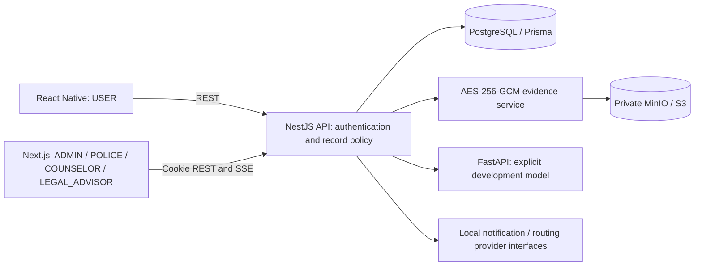

# Suraksha

Suraksha is a research/prototype platform connecting a survivor-facing React Native application with one role-based staff web application. It implements shared case handling, private evidence storage, local SOS workflows, legal-advisor queries, counseling and moderated community support.

The **three DOCX source documents** define **47 unique screens: 31 mobile and 16 staff**. All have application components. Some documented behavior remains partial or dependent on external services; this repository is not a production emergency service. The [screen inventory](docs/SCREEN_INVENTORY.md), [traceability audit](docs/TRACEABILITY_MATRIX.md) and [open gaps](docs/OPEN_GAPS.md) distinguish implemented behavior from those limits.

## Source requirements and architecture

Authoritative sources:

- `research proposal.docx`
- `Suraksha_UI_Screens_user NEW RESULT.docx`
- `Suraksha_Screen_Admin,police,counsilor.docx`

Text, tables, embedded images and source hashes are extracted under `docs/sources/`. The original four-document instruction was corrected by the user; no fourth source is required. [Conflicts and resolutions](docs/DOCUMENTATION_CONFLICTS.md) explain screen-count, privacy, scoring and terminology decisions.



A report creates one `Case.reference`, retained through Admin triage, Police assignment/investigation and the User tracker. No role-specific case database is created. Backend guards enforce roles and record access. Counselors see assigned pseudonymous clients and protected notes; general Admin access does not include clinical notes.

| Role | Application / entry | Main work |
|---|---|---|
| USER | React Native | Safety, evidence, reports, legal queries, wellbeing and community |
| ADMIN | `/admin/sign-in` | Triage, assignment, verified staff, moderation and model monitoring |
| POLICE | `/police/sign-in` | Eligible SOS alerts and assigned investigations |
| COUNSELOR | `/counselor/sign-in` | Assigned clients, sessions, private notes and follow-up |
| LEGAL_ADVISOR | `/legal/sign-in` | Consented query queue, responses and reviewed resources |

## Repository and stack

```text
apps/mobile/       Expo / React Native / TypeScript / React Navigation / TanStack Query
apps/web/          Next.js App Router / React / TypeScript, one staff application
services/api/      NestJS / Prisma / Argon2 / JWT / REST / SSE
services/ai/       Python / FastAPI / versioned analyzer interface
packages/          types, validation, shared i18n, config
scripts/           environment setup, database commands and source extraction
infrastructure     docker-compose.yml at the repository root
docs/             source analysis, implementation audit and limitations
```

PostgreSQL stores relational data and metadata. MinIO stores encrypted binary objects. Redis is provisioned for future distributed workers; current realtime uses PostgreSQL outbox records and scoped SSE. English UI catalogs exist with explicit English fallback for Sinhala/Tamil until verified translations are available.

## Prerequisites

- Node.js 22.14+ and npm; versions are pinned through `package-lock.json`.
- Docker Engine with Compose v2 for PostgreSQL, Redis, MinIO and the AI container.
- Python 3.12 if running/testing AI outside Docker.
- Android Studio/SDK for native Android builds; macOS/Xcode and signing for iOS builds.
- Chromium installed by Playwright for browser tests.

## Local installation

Run from the repository root:

```bash
npm ci
npm run setup:env
docker compose up -d --build
npm run db:generate
npm run build:packages
npm run db:migrate
npm run db:seed
```

`setup:env` copies `.env.example` and replaces placeholders with random local secrets. It preserves an existing `.env` and never prints secret values. Alternatively copy the example yourself and replace every placeholder. Do not commit `.env`, passwords or encryption keys.

Wait for PostgreSQL to be healthy before migrating. MinIO bucket creation happens automatically when the API initializes its S3 provider. Its local console is at `http://localhost:9001`; use the generated `S3_ACCESS_KEY` and `S3_SECRET_KEY` from your local environment. Buckets and evidence objects are private. Persistent Compose volumes retain data across restarts.

Start each application in a separate terminal:

```bash
npm run dev:api
npm run dev:web
npm run dev:mobile
```

The staff application opens at `http://localhost:3000`; API base is `http://localhost:4000/v1`. Root client scripts load `.env` before starting Next.js/Expo. Do not run two AI instances on port 8000: Compose already starts it.

For local Python development instead of the AI container:

```bash
docker compose stop ai
python3.12 -m venv .venv
.venv/bin/python -m pip install -r services/ai/requirements.txt
AI_PYTHON="$PWD/.venv/bin/python" npm run dev:ai
```

### Mobile device connection

Set `EXPO_PUBLIC_API_URL` in root `.env` to an address reachable by the device, then restart Metro:

- iOS simulator: `http://localhost:4000/v1`
- Android emulator: `http://10.0.2.2:4000/v1`
- Physical device: `http://<development-computer-LAN-address>:4000/v1`

The API binds to the host network interface; allow development-device access through your local firewall. Web requests must continue using the host configured by `WEB_ORIGIN`. Never expose the development stack as a public emergency service.

Expo Go supports ordinary UI development but does not include the custom Android launcher module. For native builds, use `npm run android -w @suraksha/mobile` or, on macOS, `npm run ios -w @suraksha/mobile`. Supply the public API URL to the native build environment. See [native privacy behavior](docs/NATIVE_PRIVACY.md) for launcher alias support, iOS limits, biometric prompts and device validation still required.

### Environment variables

| Variable | Purpose |
|---|---|
| `DATABASE_URL`, `POSTGRES_PASSWORD` | PostgreSQL connection and local container credential |
| `JWT_SECRET` | Access-token signing secret |
| `EVIDENCE_KEY`, `IDENTITY_LOOKUP_KEY` | Independent 32-byte hex encryption and identity-lookup keys |
| `API_PORT`, `WEB_ORIGIN` | API listener and exact permitted staff origin |
| `NEXT_PUBLIC_API_URL`, `EXPO_PUBLIC_API_URL` | Public API addresses; these contain no secrets |
| `AI_URL`, `AI_SERVICE_TOKEN` | Private service address and matching FastAPI credential |
| `S3_ENDPOINT`, `S3_REGION`, `S3_BUCKET`, `S3_ACCESS_KEY`, `S3_SECRET_KEY` | Private S3-compatible storage |
| `EVIDENCE_PROVIDER` | `s3` by default; explicit `local` filesystem fallback for development |
| `DELIVERY_PROVIDER` | `development`; no production emergency provider is configured |
| `REDIS_URL` | Provisioned Redis connection; current outbox does not use it |
| `SEED_PASSWORD` | Locally generated password for synthetic demo accounts |

Next.js inlines public configuration during production builds. Set custom `NEXT_PUBLIC_API_URL` in the build environment (or `apps/web/.env.local`) before building. Likewise supply `EXPO_PUBLIC_API_URL` for mobile exports/native builds. HTTPS and secure cookie deployment require production origin/host configuration.

## Development accounts and demo data

All seeded accounts use **your local `SEED_PASSWORD` value**, not a password committed here. Seeding is disabled when `NODE_ENV=production`.

| Role | Login |
|---|---|
| USER — Risini Demo | `200012345678` |
| ADMIN — Nimali Demo | `SL-ADM-0192` |
| POLICE — Officer Silva Demo | `WP-CDU-0044` |
| COUNSELOR — Dr. Ishara Demo | `CNS-0071` |
| LEGAL_ADVISOR — Adv. Fernando Demo | `LGL-0012` |

`SL-2291` is a synthetic anonymous case shared by User/Admin/assigned Police. Seeded counselor slots are relative to seed time; re-run seed if they expire. Legal guide titles are unpublished drafts with no fabricated legal text. Model records have no fabricated accuracy. Dashboard counts come from the current database, which is demo data locally.

## Verification and builds

Use a disposable local development database; integration tests write and clean synthetic records. Browser tests add synthetic reports to the seeded account. Never point these tests at production data.

```bash
npm run build:packages
npm run build -w @suraksha/api
npm run lint
npm run typecheck
npm run format:check
npm test
RUN_PROVIDER_TESTS=1 npm test
npm run test:mobile
.venv/bin/python -m pytest services/ai/test_model.py -q
npm run build
npx playwright install chromium
npm run test:e2e
node scripts/audit-documentation.mjs
```

Ordinary Vitest tests need PostgreSQL and valid root `.env`. Provider tests additionally require MinIO and FastAPI running with matching configuration. Playwright starts compiled API/Next.js servers, logs into seeded staff accounts and verifies the same case reference through User API submission, Admin browser assignment, Police browser update and User API tracking. It also tests cross-workspace denial. This is not a real mobile-device E2E run; React Native interactions are covered separately by Testing Library.

`npm run build` compiles shared packages, NestJS, Next.js and exports Android/iOS Hermes JavaScript bundles. It does **not** create signed APK/IPA packages. See [verification evidence](docs/VERIFICATION.md) for actual results and remaining native/visual checks.

## Security and current limitations

Passwords/PINs use Argon2. Access tokens are short-lived; refresh sessions rotate and support revocation/replay detection. Web refresh cookies are HttpOnly; mobile refresh credentials use SecureStore. Server authorization checks roles, assignment and ownership. Evidence uses AES-256-GCM with random nonces and SHA-256 integrity checks, private storage and authorized audited downloads. This is server-managed encryption at rest, **not end-to-end encryption or security certification**. Production KMS/rotation, deployment hardening, backup retention and recovery policies remain work.

The development SOS provider records local events and contacts **no real emergency service or trusted-contact phone**. Routes are illustrative, not validated safe navigation. AI is explicitly non-validated and supplies no measured accuracy. Legal content and a validated clinical screener are missing from the source set. OCR, production notifications, background location, native disguise validation, full verified translations and comprehensive visual/device tests remain partial. The exact status of every documented screen and cross-cutting requirement is in the audit; nothing is marked complete merely because it compiles.

## Documentation

- [Requirements](docs/REQUIREMENTS.md), [screen inventory](docs/SCREEN_INVENTORY.md), [traceability](docs/TRACEABILITY_MATRIX.md)
- [Roles and permissions](docs/ROLE_PERMISSION_MATRIX.md), [workflows](docs/WORKFLOWS.md)
- [Data model](docs/DATA_MODEL.md), [API contracts](docs/API_SPEC.md), [architecture decisions](docs/ARCHITECTURE.md)
- [Conflicts](docs/DOCUMENTATION_CONFLICTS.md), [open gaps](docs/OPEN_GAPS.md), [verification](docs/VERIFICATION.md)
- [Native privacy](docs/NATIVE_PRIVACY.md), [AI research requirements](services/ai/RESEARCH.md)

Recreate source extraction with `python3 scripts/extract_documentation.py`. Requirements are attributed to sources; implementation decisions and current limitations are labeled separately throughout these documents.
