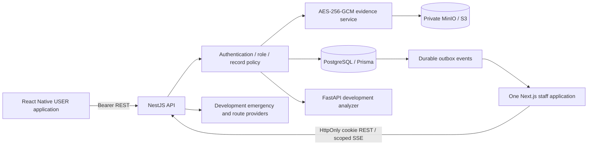

# Implemented architecture

The three DOCX sources define product behavior; `SCREEN_INVENTORY.md` defines 47 unique screens. This document records implementation decisions. `OPEN_GAPS.md` identifies unavailable or incomplete behavior.

Shared packages contain role/data types, Zod validation, configuration and translation-ready UI strings. Mobile uses React Navigation and TanStack Query; the staff client uses scoped fetch hooks and server-rendered App Router entry points. Both talk to `/v1`; no frontend role check substitutes for API authorization.

A report creates a Case, Report, evidence links, initial CaseEvent and notification/outbox records transactionally. A database sequence creates the stable `SL-` reference. Assignment and stage updates check expected versions. Case serializers return role-specific projections; clinical/legal messages and notes are separate aggregates and are never joined into generic Admin case detail.

Auth validates the current database session and account on protected requests. Refresh credentials are stored hashed and rotate in a transaction. Staff verification is independent of role. Passwords and PINs use Argon2; identity fields and sensitive message/note content use authenticated encryption. Tokens never grant unrestricted object access.

Evidence binaries remain outside ordinary database rows. The service assigns random storage keys, hashes plaintext, encrypts with a fresh nonce and stores metadata. Authorized reads verify authenticated encryption and digest; sealed owner reads require short-lived PIN proof. A local-filesystem provider is available only as an explicit development fallback. No evidence URL is public.

SOS alerts are persisted before a development delivery receipt is returned. Provider records explicitly say DEVELOPMENT_RECORDED; real police/SMS/push delivery is not connected. The map/route provider returns illustrative coordinates with `validatedSafe: false`. Local polling/SSE uses scoped outbox audiences; Redis is provisioned but not yet used for distributed delivery.

FastAPI is isolated behind a service credential. NFC preprocessing and language/script handling lead to a versioned model interface. The bundled model is a DEVELOPMENT DEMO without validated confidence. Artifact loading refuses unavailable model files; there is no fabricated trained model. Reviewed legal resources support human advisors; legal generation has no corpus and does not fabricate answers.

See DATA_MODEL.md for storage mapping, API_SPEC.md for registered routes, NATIVE_PRIVACY.md for platform behavior, and VERIFICATION.md for actual checks and their limits.
